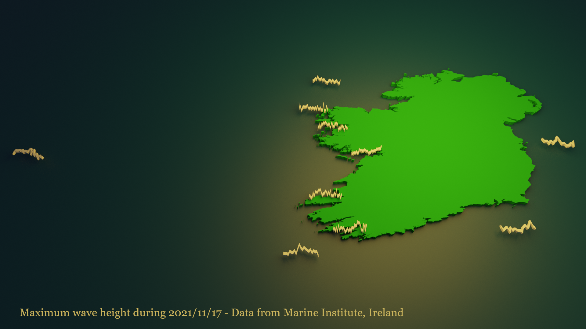
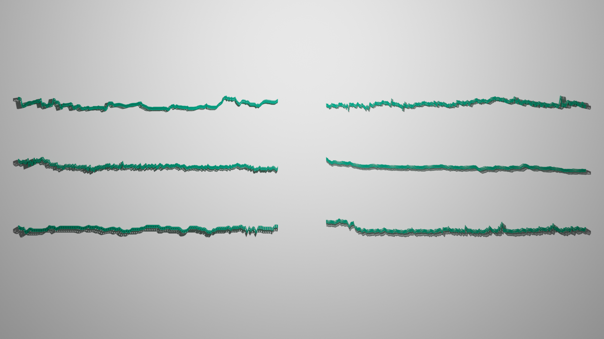

# bpyd2

A Python library for creating data driven scenes in Blender.

The API is documented [here](bpyd2.md).

## Pre-requisites

  - Python 3.9.2 or greater
  - Blender 2.93.5 or greater
  
## Dependencies

Outside of the core Python libraries, the only dependency is the `bpy` library which forms the core API of Blender. If you are working with bpyd2 inside Blender, this will already be there. For testing / development purposes,

```Shell
python -m pip install bpy
```

## Installation

```Shell
python -m pip install git+https://github.com/adamml/bpyd2.git
```

## Gallery and examples

### Wave heights around Ireland

|[]()| |
|----|----|
| | <iframe width="560" height="315" src="https://www.youtube.com/embed/4Z14M2PZc9U" title="YouTube video player" frameborder="0" allow="accelerometer; autoplay; clipboard-write; encrypted-media; gyroscope; picture-in-picture" allowfullscreen></iframe> |

### World marathon majors elevation plots



## Building the documentation

The documentation for the module is generated with pdoc-markdown:

```Shell
pydoc-markdown -I . -m bpy2d --render-toc > bpyd2.md
```